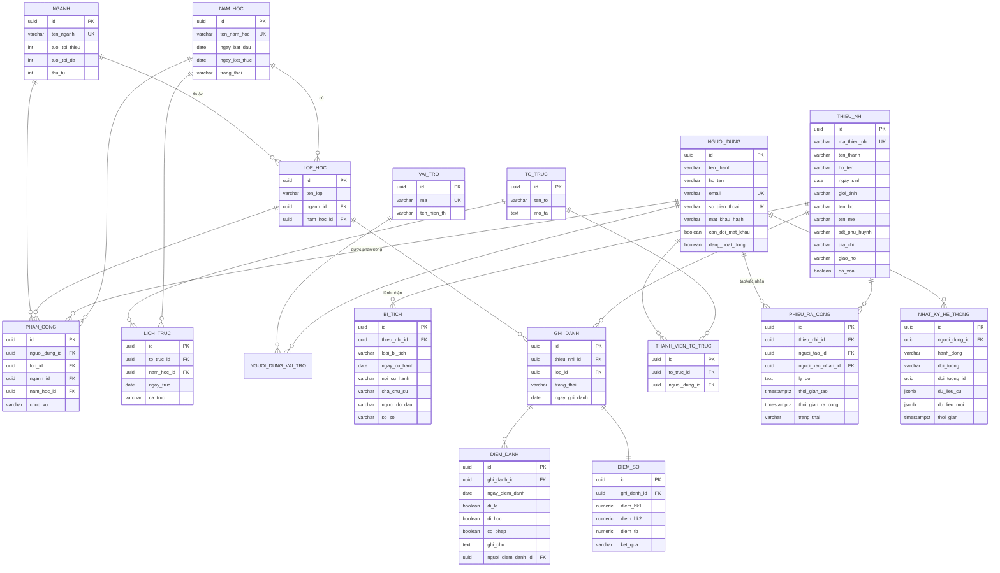

# 03 — Mô hình dữ liệu (ERD)

## Sơ đồ quan hệ (Mermaid)

Dán đoạn dưới vào <https://mermaid.live> hoặc bất kỳ trình đọc Markdown hỗ trợ Mermaid
để xem sơ đồ trực quan.



---

## Giải thích các quyết định thiết kế

### 1. Dùng UUID làm khoá chính
Không dùng số tự tăng 1, 2, 3. Lý do: người ngoài không đoán được số lượng hồ sơ qua URL;
và nếu sau này gộp dữ liệu của nhiều xứ đoàn thì không bị đụng ID.
Dùng **UUID v7** (`uuid_generate_v7` hoặc sinh ở tầng Java) để giữ tính tuần tự, tránh
phân mảnh index như UUID v4.

### 2. Tách bảng `BI_TICH` ra khỏi `THIEU_NHI`, quan hệ 1-N
Bản thiết kế ban đầu để 1-1 với các cột `ngay_rua_toi`, `ngay_ruoc_le`... Không đủ, vì:
- Mỗi bí tích cử hành ở nơi khác nhau, cha chủ sự khác nhau, người đỡ đầu khác nhau.
- Còn Xưng Tội lần đầu và Bao Đồng.
- Thêm loại bí tích mới sau này chỉ cần thêm dòng, không cần `ALTER TABLE`.

### 3. `NGUOI_DUNG_VAI_TRO` là N-N, không phải cột enum
Một người vừa là Huynh trưởng lớp Ấu 1A vừa thuộc Ban Kỷ luật là chuyện bình thường.
Cột enum đơn sẽ chật ngay ở sprint 7.

### 4. `PHAN_CONG` gắn với năm học
Phân công lớp thay đổi mỗi năm. Nếu để `lop_hoc.nguoi_dung_id` như thiết kế ban đầu thì
mất lịch sử "năm ngoái ai dạy lớp này" và không xử lý được lớp có hai huynh trưởng.
Cột `lop_id` và `nganh_id` loại trừ nhau: phân công cấp lớp thì `nganh_id` null, và ngược lại.

### 5. `DIEM_DANH` và `DIEM_SO` trỏ về `GHI_DANH`, không trỏ thẳng về `THIEU_NHI`
Vì điểm danh luôn thuộc về "em này, ở lớp này, năm học này". Trỏ qua ghi danh thì tự động
có đủ ngữ cảnh, không cần lặp lại `lop_id` và `nam_hoc_id`.

### 6. Ràng buộc chống trùng bắt buộc phải có
```sql
UNIQUE (ghi_danh_id, ngay_diem_danh)   -- chống điểm danh trùng khi 2 người cùng bấm
UNIQUE (thieu_nhi_id, loai_bi_tich)     -- một em chỉ lãnh nhận mỗi bí tích một lần
UNIQUE (ten_lop, nam_hoc_id)            -- tên lớp duy nhất trong một năm học
UNIQUE (ghi_danh_id)  ON diem_so        -- quan hệ 1-1
```
Cộng thêm partial index chống một em có hai ghi danh `DANG_HOC` cùng năm học, và chống
hai phiếu ra cổng `CHO_RA_CONG` cùng lúc cho một em.

### 7. Soft delete cho `THIEU_NHI`
Cột `da_xoa boolean`. Hồ sơ trẻ em không xoá cứng — có thể cần tra cứu bí tích nhiều năm sau.
Mọi truy vấn mặc định thêm `WHERE da_xoa = false`.

### 8. `NHAT_KY_HE_THONG` (audit log)
Bắt buộc vì đây là dữ liệu cá nhân của người dưới 18 tuổi. Ghi lại mọi thao tác thêm/sửa/xoá
hồ sơ thiếu nhi, tạo/xác nhận phiếu ra cổng, thay đổi phân quyền. Lưu `du_lieu_cu` và
`du_lieu_moi` dạng JSONB để truy vết được ai đổi cái gì.

### 9. Cột chuẩn ở mọi bảng
Mọi bảng đều có `ngay_tao timestamptz`, `ngay_cap_nhat timestamptz`, `nguoi_tao_id uuid`,
`nguoi_cap_nhat_id uuid`. Trong Java dùng `@MappedSuperclass BaseEntity` với
`@CreatedDate`, `@LastModifiedBy` (Spring Data JPA Auditing).

---

## Chỉ mục (Index) cần tạo

```sql
CREATE INDEX idx_ghi_danh_lop      ON ghi_danh(lop_id) WHERE trang_thai = 'DANG_HOC';
CREATE INDEX idx_diem_danh_ngay    ON diem_danh(ngay_diem_danh);
CREATE INDEX idx_diem_danh_ghidanh ON diem_danh(ghi_danh_id);
CREATE INDEX idx_thieu_nhi_hoten   ON thieu_nhi USING gin (to_tsvector('simple', ho_ten));
CREATE INDEX idx_phieu_cho_ra_cong ON phieu_ra_cong(trang_thai, thoi_gian_tao)
       WHERE trang_thai = 'CHO_RA_CONG';
CREATE INDEX idx_phan_cong_nguoi   ON phan_cong(nguoi_dung_id, nam_hoc_id);
```

Chỉ mục full-text trên `ho_ten` để tìm kiếm tên tiếng Việt nhanh khi có 3.000 hồ sơ.

---

## Enum sử dụng

| Enum | Giá trị |
|---|---|
| `trang_thai_nam_hoc` | `CHUAN_BI`, `DANG_HOAT_DONG`, `DA_KET_THUC` |
| `loai_bi_tich` | `RUA_TOI`, `XUNG_TOI_LAN_DAU`, `RUOC_LE_LAN_DAU`, `THEM_SUC`, `BAO_DONG` |
| `trang_thai_ghi_danh` | `DANG_HOC`, `CHUYEN_XU`, `NGHI_HOC`, `HOAN_THANH` |
| `ket_qua_hoc_tap` | `DAT`, `KHONG_DAT`, `CHUA_XET` |
| `trang_thai_phieu` | `CHO_RA_CONG`, `DA_RA_CONG`, `HUY` |
| `chuc_vu_phan_cong` | `CHU_NHIEM`, `PHU_TA`, `TRUONG_NGANH` |
| `ma_vai_tro` | `ADMIN`, `KHOI_TRUONG`, `HUYNH_TRUONG`, `KY_LUAT` |

Lưu dạng `VARCHAR` + `CHECK` constraint trong PostgreSQL (dễ thêm giá trị hơn native enum),
ánh xạ sang Java `enum` bằng `@Enumerated(EnumType.STRING)`.
